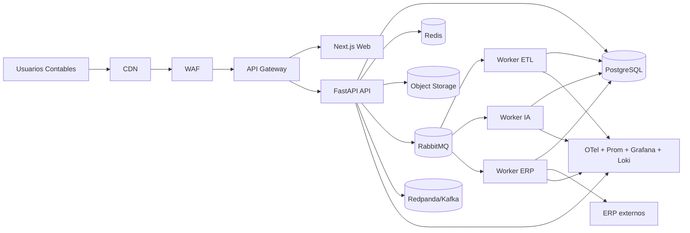
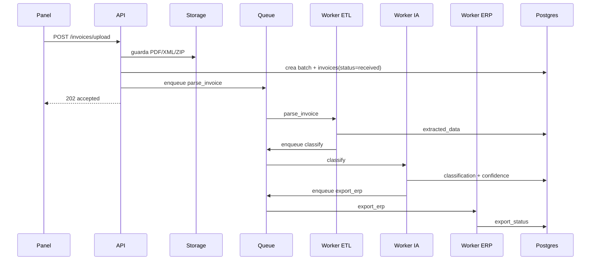
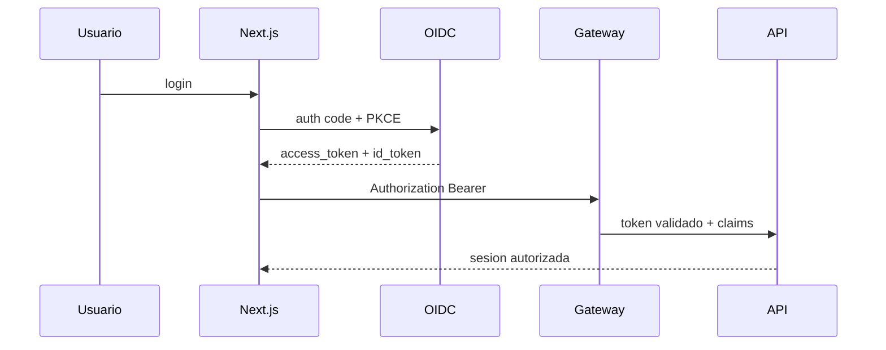
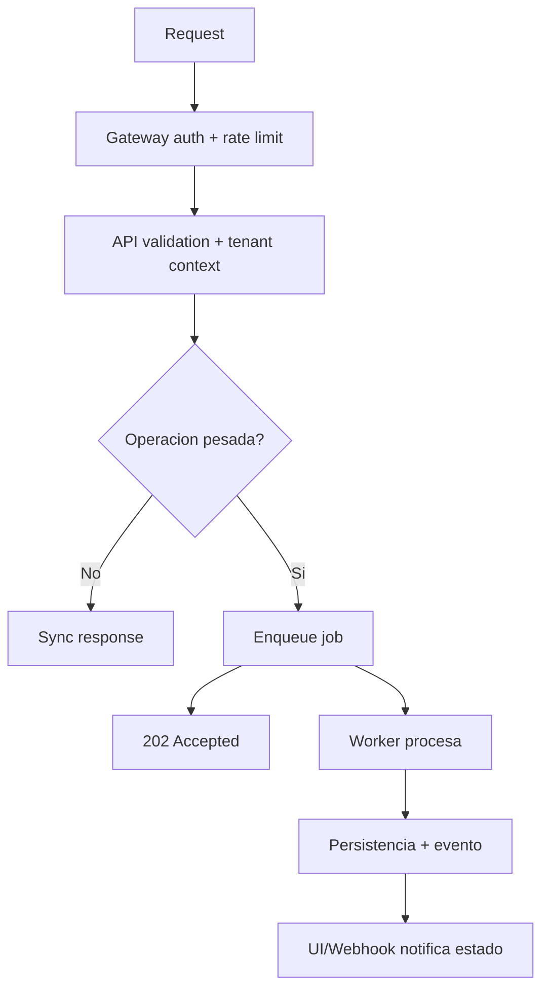

# Diagramas

## Diagrama Logico

```mermaid
flowchart LR
  U[Usuarios Contables] --> CDN[CDN]
  CDN --> WAF[WAF]
  WAF --> GW[API Gateway]
  GW --> WEB[Next.js Web]
  GW --> API[FastAPI API]
  API --> PG[(PostgreSQL)]
  API --> R[(Redis)]
  API --> S3[(Object Storage)]
  API --> MQ[(RabbitMQ)]
  API --> BUS[(Redpanda/Kafka)]
  MQ --> WK1[Worker ETL]
  MQ --> WK2[Worker IA]
  MQ --> WK3[Worker ERP]
  WK1 --> PG
  WK2 --> PG
  WK3 --> PG
  WK3 --> ERP[ERP externos]
  API --> O11Y[OTel + Prom + Grafana + Loki]
  WK1 --> O11Y
  WK2 --> O11Y
  WK3 --> O11Y
```

## Flujo de Datos ETL

```mermaid
sequenceDiagram
  participant UI as Panel
  participant API as API
  participant OBJ as Storage
  participant MQ as Queue
  participant ETL as Worker ETL
  participant AI as Worker IA
  participant ERP as Worker ERP
  participant DB as Postgres

  UI->>API: POST /invoices/upload
  API->>OBJ: guarda PDF/XML/ZIP
  API->>DB: crea batch + invoices(status=received)
  API->>MQ: enqueue parse_invoice
  API-->>UI: 202 accepted

  MQ->>ETL: parse_invoice
  ETL->>DB: extracted_data
  ETL->>MQ: enqueue classify

  MQ->>AI: classify
  AI->>DB: classification + confidence
  AI->>MQ: enqueue export_erp

  MQ->>ERP: export_erp
  ERP->>DB: export_status
```

## Flujo de Autenticacion

```mermaid
sequenceDiagram
  participant U as Usuario
  participant FE as Next.js
  participant IDP as OIDC
  participant GW as Gateway
  participant API as API

  U->>FE: login
  FE->>IDP: auth code + PKCE
  IDP-->>FE: access_token + id_token
  FE->>GW: Authorization Bearer
  GW->>API: token validado + claims
  API-->>FE: sesion autorizada
```

## Flujo de Request

```mermaid
flowchart TD
  A[Request] --> B[Gateway auth + rate limit]
  B --> C[API validation + tenant context]
  C --> D{Operacion pesada?}
  D -->|No| E[Sync response]
  D -->|Si| F[Enqueue job]
  F --> G[202 Accepted]
  F --> H[Worker procesa]
  H --> I[Persistencia + evento]
  I --> J[UI/Webhook notifica estado]
```
